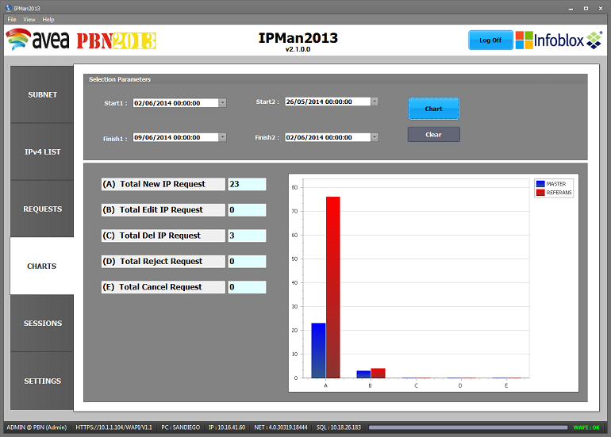
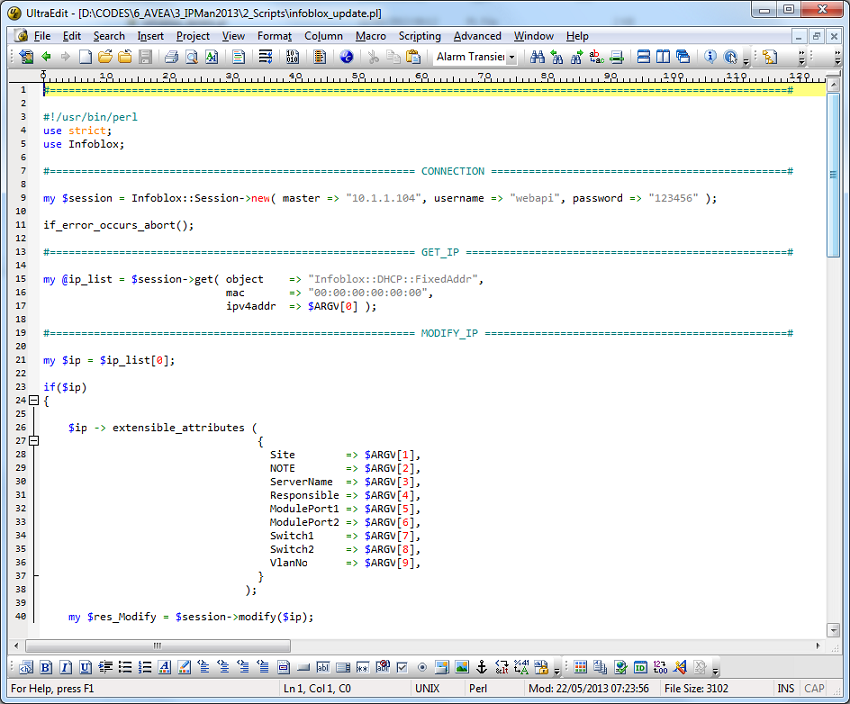

# IPMan2013

Analysis and Development Document

| **Written by** | Hasan YILDIRIM ( SAP/NET Consultant) \@ **PIA** |
|----------------|-------------------------------------------------|
| **Email**      | HasanYildirim@hotmail.com                       |
| **Place**      | TeknoPark / Kurtkoy / İSTANBUL                  |
| **Date**       | 05.June.2014                                    |
| **Version**    | v1.0                                            |


## [1] Purpose of This Software :

Managing IP addresses with reservation process is a crutial system in a wide
range network. To handle this complex senario, IPMan2013 was developed with PBN
and NMS system engineers. Instead of using multiple applications, this single
and simple interface provides easy to use for corparate users.


## [2] Infrastructure of Reservation Process :

To understand how the application reservation process works, the following
picture should be evaluated. As you seen, there are 3 main groups in the
corporate.

**I) PBN Group**

**II) IT Group**

**III) CABLING Group**

In the next chapters, we will be discussing how to define groups in Application
Settings window including other important parameters.

The flowchart diagram shows IP Management Steps from start to end. Users should
know this picture before to use application. After understanding the picture, it
would be easy to figure out application chapters.


**Database Requirement**

This Tool relies heavily on past data, in order to analyse or forcast, but
unfortunately since the storing the raw data for 3 years will require a huge
system and would coste a lot, a decision has been made to go with the condense
type of data and save for 1 year only for now.

**Used Software Technologies and Methods :**

        Devlopment Tool     : Microsoft Visual Studio 2012 Ultimate
        WAPI Client         : Microsoft WAPI Client v4.0
        ORM                 : MS Entity Framework v5.0
        Database            : Microsoft SQL Server 2012
        Json.NET            : JSON Framework Lv5.0
        Visual Comps.       : DevExpress v12.2.8
        Development Lang    : Visual C# 4.0
        NET Framework       : Version 4.0

**Microsoft** software development technologies have been used to develop this
tool and SQL Server was stand for backend.

As thirt party tools, Devexpress .Net components have been used for graphicial
interface. It provides user to have easy to use interface especially on grids,
lists and reports.

**DevExpress** (Developer Express Inc) is a software development company founded
in 1998 with headquarters in Glendale, California. DevExpress initially started
producing UI Controls for Borland Delphi/C++Builder and ActiveX Controls for
Microsoft Visual Studio. Presently, DevExpress has products targeting developers
that use Delphi/C++Builder, Visual Studio and HTML5/JavaScript technologies.

**Json.NET** is a popular high-performance JSON framework for .NET.

**Benefits and Features:**

        -   Flexible JSON serializer for converting between .NET objects and JSON
        -   LINQ to JSON for manually reading and writing JSON
        -   High performance, faster than .NET's built-in JSON serializers
        -   Write indented, easy to read JSON
        -   Convert JSON to and from XML
        -   Supports .NET 2, .NET 3.5, .NET 4, .NET 4.5, Silverlight, Windows Phone.

The JSON serializer in Json.NET is a good choice when the JSON you are reading
or writing maps closely to a .NET class.

**WAPI** a web API is the application programming interface (API) for both the
web server and web browser. While "web API" in this context is sometimes
considered a synonym for web service, Web 2.0 web applications have moved away
from SOAP-based web services towards more cohesive collections of RESTful web
resources.

## [3] INFOBLOX WAPI Sample Codes and Results :


**NetworkView: ZG5zLm5ldHdvcmtfdmlldyQw**

**https://10.1.1.104/wapi/v1.0/network?_return_type=xml-pretty**


**ZG5zLm5ldHdvcmskMjAuMjAuMjAuMC8yOC8w**
**Ref1: ZG5zLm5ldHdvcmskMjAuMjAuMjAuMC8yNC8w -\> 20.20.20.0**
**Ref2: ZG5zLm5ldHdvcmskMzAuMzAuMzAuMC8yNC8w -\> 30.30.30.0**

**I want to make the following curl call in my C\# console application:**

Well, you wouldn't call [cURL](http://curl.haxx.se/) directly, rather, you'd use
one of the following options:

-   [HttpWebRequest](http://msdn.microsoft.com/en-us/library/system.net.httpwebrequest.aspx)/[HttpWebResponse](http://msdn.microsoft.com/en-us/library/system.net.httpwebresponse.aspx)

-   [WebClient](http://msdn.microsoft.com/en-us/library/system.net.webclient.aspx)

-   [HttpClient](http://msdn.microsoft.com/en-us/library/system.net.http.httpclient%28v=vs.110%29.aspx) (available
    from .NET 4.5 on)

**I'd highly recommend using the HttpClient class, as it's engineered to be much
better (from a usability standpoint) than the former two.**

**In your case, you would do this:**

```csharp
   using System.Net.Http;
   var client = new HttpClient();

   // Create the HttpContent for the form to be posted.
   var requestContent = new FormUrlEncodedContent(new [] {
   new KeyValuePair<string, string>("text", "This is a block of text")});

   // Get the response.
   HttpResponseMessage response = await client.PostAsync("http://api.repustate.com/v2/demokey/score.json", requestContent);

   // Get the response content.
   HttpContent responseContent = response.Content;

   // Get the stream of the content.
   using (var reader = new StreamReader(await responseContent.ReadAsStreamAsync()))
   {
      // Write the output.
      Console.WriteLine(await reader.ReadToEndAsync());
   }       
```

**https://10.1.1.104/wapi/v1.0/network?comment\~:=test**


**https://10.1.1.104/wapi/v1.0/network?network=20.20.20.0**


Reservation of first Ten IP Numbers:

**X.X.X.1 X.X.X.10**


**search_string**

Pattern to search for. In most cases, using regular expression (\~=) will be the
preferred method. Using equal match

(=) matches only complete, not partial, fields. This field is required for
searches.

The field is searchable via

**• := (case insensitive search)**
**• = (exact equality)**
**• \~= (regular expression)**

**Notes:** search_string is a search-only field.

**[ Query in Entensible_Attributes ]**

**https://10.1.1.104/wapi/v1.0/network?\*Site\~:=Gunesli&_return_fields=comment,network,extensible_attributes&_max_results=5**


**[ Query in Network with IP Range ]**

**https://10.1.1.104/wapi/v1.0/network?network\~=46.104&_return_fields=comment,network,extensible_attributes&_max_results=5**


**[ Next Available IP ]**

**https://10.1.1.104/wapi/v1.0/network/ZG5zLm5ldHdvcmskMTAuNC4zMC4wLzI0LzA:10.4.30.0/24/default?_function=next_available_ip&num=20&_method=POST**


**[ ipv4address ]**

**https://10.1.1.104/wapi/v1.0/ipv4address?ip_address\>=10.4.30.11&_max_results=50&status=UNUSEDNEXT_AVAILABLE_IP_LIST**


## [4] Data Model :

**Microsoft Entity Framework** used for data operations with LINQ language.
Developing single data access layer makes application easy to manage and clear
coding. It also provides strong security over db objects…

Entity Framework (EF) is an open source object-relational mapping (ORM)
framework for ADO.NET, part of .NET Framework. The Entity Framework is a set of
technologies in ADO.NET that support the development of data-oriented software
applications. Architects and developers of data-oriented applications have
struggled with the need to achieve two very different objectives. They must
model the entities, relationships, and logic of the business problems they are
solving, and they must also work with the data engines used to store and
retrieve the data.


We can see application’s tables as above schema. If need to know what are the
important db objects in the platform:

-   **TableGroup :** Keeps all the Group Details including emails, descs and status.
-   **TableUser :** Stores all application users with login specifacitons This table has relation with TableGroup. Ever user must be included in a group.
-   **TableServer :** Stores INFOBLOX production server as IP Address.
-   **TableSubnet :** Descriptions of all available subnets in the app.
-   **TableRequest :** Transaction table tracks all user requests for IPs.

## [5] Application Interface :

The application consists of 5 main secreens as follow:


**SUBNET :** This screen shows all avaiable subnet range under selected subnets.
This subnet list can be configured under settings.


**Ipv4 LIST :** After selecting a subnet, user can have full available IP list.
User can start IP reservation process from here.


**RQUESTS :** Shows all IP reservervation pool including with approved levels.


**CHARTS:** Displays graphical version of result numbers. It is good view to
compare different time periods. It is a good screen to compare weeks based on
total numbers.



**SESSIONS :** Shows all active and passive system login details…


## [6] Application Setup :

**http://10.18.26.183/IPMAN2013/Setup.htm**


## [7] Application Key Features :

Here is the key feature list of the application:

-   **The application provides a single interface to talk InfoBlox server and
    tracking reservation records…**

-   **User can do Reclaim / Resolve / Request process independently**

-   **Application managers can configure available subnet levels. They have also
    ability to redefine Server IP addresses over settings page.**

-   **Managers can monitor users login and status under Session Page.**

-   **Application can inform required users and groups by email at some
    reservation period.**

## [8] PERL Scripts:

>   **DELETE PROCESS**


>   **PING PROCESS**


>   **UPDATE PROCESS**


